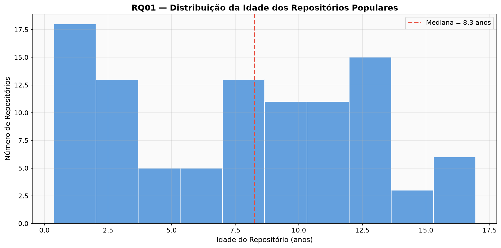
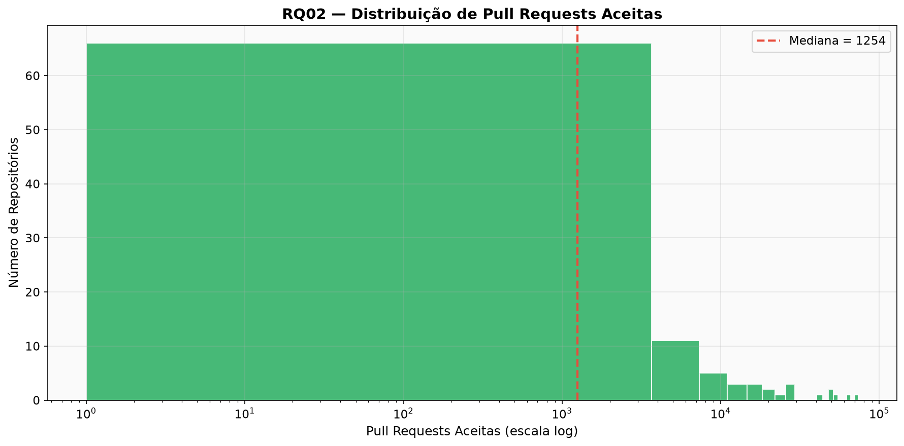
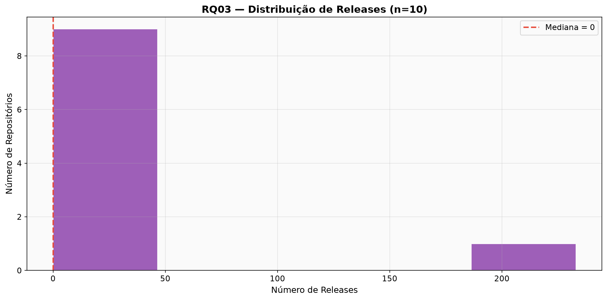
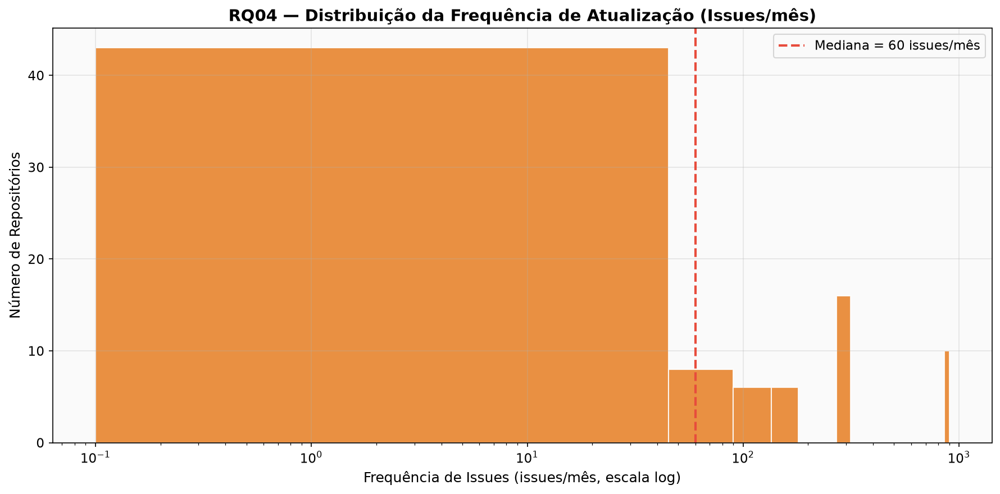
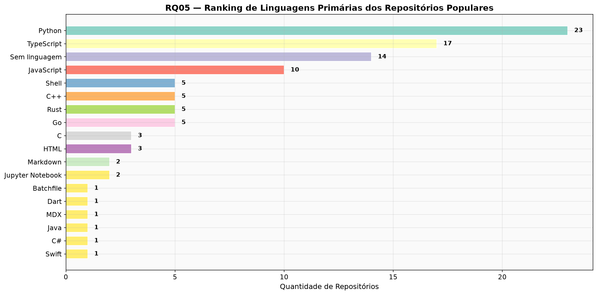
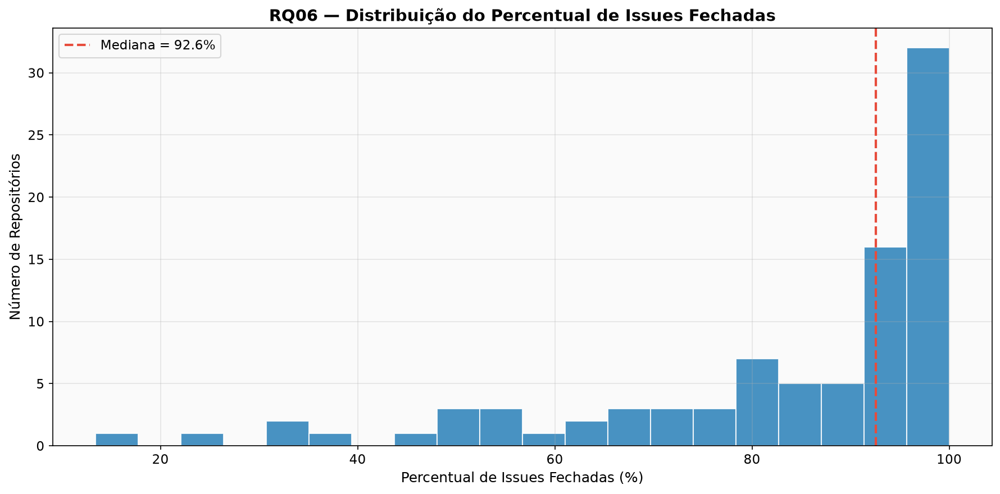
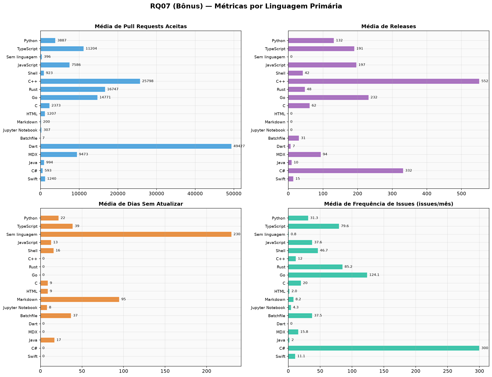

# Lab01 — Características de Repositórios Populares do GitHub

## Hipóteses Informais

---

**RQ 01.** Sistemas populares são maduros/antigos?
Métrica: idade do repositório (calculado a partir da data de sua criação)

A favor:
- Repositórios mais antigos tiveram mais tempo para acumular estrelas organicamente, portanto é esperado que a maioria dos sistemas populares tenha vários anos de existência
- Projetos maduros tendem a ser mais estáveis e confiáveis, o que atrai mais usuários ao longo do tempo

Contra:
- O ecossistema de IA/LLM explodiu nos últimos 2 anos, e vários repositórios recentes já atingiram centenas de milhares de estrelas em poucos meses
- Projetos virais podem ganhar popularidade rapidamente independentemente da idade

---

**RQ 02.** Sistemas populares recebem muita contribuição externa?
Métrica: total de pull requests aceitas

A favor:
- Projetos populares atraem uma comunidade grande de desenvolvedores, o que gera mais contribuições via pull requests
- A visibilidade do projeto incentiva contribuições open-source, seja por altruísmo ou por busca de reconhecimento profissional

Contra:
- Muitos repositórios populares são listas curadas (awesome lists) ou materiais educacionais, que não recebem contribuição técnica significativa via PRs
- Alguns projetos grandes usam sistemas de code review externos (ex.: Gerrit no Go), não refletindo contribuições via PRs do GitHub

---

**RQ 03.** Sistemas populares lançam releases com frequência?
Métrica: total de releases

A favor:
- Projetos populares tendem a ter ciclos de desenvolvimento ativos, com releases frequentes para entregar novas funcionalidades e correções
- Uma comunidade grande demanda atualizações constantes, incentivando releases mais frequentes

Contra:
- Muitos repositórios populares são repositórios de conteúdo (listas, tutoriais, livros), que não seguem o modelo de releases versionadas
- Alguns projetos preferem entregas contínuas (continuous deployment) sem usar o mecanismo de releases formal do GitHub

---

**RQ 04.** Sistemas populares são atualizados com frequência?
Métrica: tempo até a última atualização

A favor: 
- Por mais pessoas conhecerem, provavelmente há mais contribuição para manter o repositorio atualizado e acompanhando as novas tecnologias (quando possível)
- Novas pessoas encontram o sistema e possuam novas visões de contribuições/oportunidades de melhorias

Contra:
- As mais populares já atingiram um ponto ótimo e duas atualizações são apenas correções quando necessárias, sendo de baixa frequência

---

**RQ 05.** Sistemas populares são escritos nas linguagens mais populares?
Métrica: linguagem primária de cada repositório
*(defina e referencie explicitamente a fonte usada para "linguagens mais populares" — ex.: TIOBE Index, GitHut ou o Octoverse do GitHub — mantendo a mesma referência ao longo de todo o laboratório)*

A favor:
- Uma linguagem mais popularé mais acessivel por haver mais fonte de estudo.
- A linguagem se tornou mais famosa pelo grande número de sistemas , assim um fator impulssiona o outro (há mais sistemas na linguagem mais popular justamente por ter mais material de estudo e estuturas prontas para uso da mesma linguagem)

---

**RQ 06.** Sistemas populares possuem um alto percentual de issues fechadas?
Métrica: razão entre issues fechadas e total de issues

- Com maior número de usuários interagindo com o repositório, haverá mais contribuições para as issues que ainda estiverem em aberto.

---

**Bônus (+1 ponto) — RQ 07:** Sistemas escritos em linguagens mais populares recebem mais contribuição externa, lançam mais releases e são atualizados com mais frequência? (divida os resultados das RQs 02, 03 e 04 por linguagem)

---

## Resultados

> **Nota:** Os resultados abaixo foram gerados automaticamente pelo script `analise_resultados.py` a partir dos CSVs coletados para os **100 repositórios** mais populares do GitHub (sprint S01). Quando a coleta for ampliada para 1.000 repositórios (sprint S02), basta re-rodar o script para atualizar os valores e gráficos.

### RQ01 — Sistemas populares são maduros/antigos?

| Estatística | Valor |
|---|---|
| Repositórios analisados | 100 |
| Idade mínima | 0,4 anos |
| Q1 | 3,2 anos |
| **Mediana** | **8,3 anos** |
| Q3 | 11,7 anos |
| Idade máxima | 17,0 anos |

A mediana de **8,3 anos** indica que a maioria dos sistemas populares é relativamente madura. No entanto, nota-se um pico de repositórios com menos de 2 anos (18 repos), refletindo o boom recente de projetos ligados a IA/LLMs.

---

### RQ02 — Sistemas populares recebem muita contribuição externa?

| Estatística | Valor |
|---|---|
| Repositórios analisados | 100 |
| Mínimo | 0 PRs |
| Q1 | 240 PRs |
| **Mediana** | **1.254 PRs** |
| Q3 | 6.994 PRs |
| Máximo | 73.388 PRs |

A mediana de **1.254 pull requests aceitas** sugere que repositórios populares recebem contribuição externa significativa. A distribuição é fortemente assimétrica, com outliers como `rust-lang/rust` (73.388) e `kubernetes/kubernetes` (65.645). Três repositórios têm 0 PRs aceitas — `torvalds/linux` e `awesome-selfhosted/awesome-selfhosted` não usam o mecanismo de PRs do GitHub, e `DigitalPlatDev/FreeDomain` é um projeto de conteúdo.

---

### RQ03 — Sistemas populares lançam releases com frequência?

> ⚠️ **Dados incompletos:** O arquivo `releases.csv` contém apenas **10 de 100 repositórios**. Os resultados abaixo são parciais e serão atualizados após re-execução do script `RQ03_Releasses.py`.

| Estatística | Valor |
|---|---|
| Repositórios analisados | 10 (incompleto) |
| Mediana | 0 releases |
| Sem releases | 8 (80%) |
| Com releases | 2 (20%) |
| Máximo | 233 releases |

Dos 10 repositórios disponíveis, **80% não possuem releases**, o que reflete a predominância de repositórios de conteúdo entre os mais estrelados. O único repositório com releases expressivos é `openclaw/openclaw` (233).

---

### RQ04 — Sistemas populares são atualizados com frequência?

| Estatística | Valor |
|---|---|
| Repositórios analisados | 89 (11 sem issues) |
| Mínimo | 0 issues/mês |
| Q1 | 5 issues/mês |
| **Mediana** | **60 issues/mês** |
| Q3 | 300 issues/mês |
| Máximo | 900+ issues/mês |

| Categoria | Qtd |
|---|---|
| Sem issues | 11 |
| 0 issues/mês | 4 |
| 1–10 issues/mês | 25 |
| 11–100 issues/mês | 28 |
| 101–299 issues/mês | 6 |
| ≥300 issues/mês | 16 |
| Múltiplas/dia (>900/mês) | 10 |

A mediana de **60 issues/mês** indica alta atividade. A maioria dos repositórios (28) tem entre 11 e 100 issues/mês. Os 10 repositórios com "Múltiplas issues no mesmo dia" são grandes projetos de software como `vscode`, `flutter`, `kubernetes` e `rust-lang/rust`.

---

### RQ05 — Sistemas populares são escritos nas linguagens mais populares?

| Linguagem Primária | Repositórios | % |
|---|---|---|
| Python | 23 | 23,0% |
| TypeScript | 17 | 17,0% |
| Sem linguagem | 14 | 14,0% |
| JavaScript | 10 | 10,0% |
| Shell | 5 | 5,0% |
| C++ | 5 | 5,0% |
| Rust | 5 | 5,0% |
| Go | 5 | 5,0% |
| C | 3 | 3,0% |
| HTML | 3 | 3,0% |
| Markdown | 2 | 2,0% |
| Jupyter Notebook | 2 | 2,0% |
| Batchfile | 1 | 1,0% |
| Dart | 1 | 1,0% |
| MDX | 1 | 1,0% |
| Java | 1 | 1,0% |
| C# | 1 | 1,0% |
| Swift | 1 | 1,0% |

As três linguagens mais representadas — **Python (23%), TypeScript (17%) e JavaScript (10%)** — são também as mais populares segundo o GitHub Octoverse. Os 14 repositórios "Sem linguagem" são predominantemente listas curadas (awesome lists) e materiais de referência.

---

### RQ06 — Sistemas populares possuem um alto percentual de issues fechadas?

| Estatística | Valor |
|---|---|
| Repositórios com issues | 89 |
| Sem issues (N/A) | 11 |
| Mínimo | 13,41% |
| Q1 | 76,25% |
| **Mediana** | **92,59%** |
| Q3 | 97,52% |
| Máximo | 100,00% |

| Faixa | Qtd |
|---|---|
| < 50% | 7 |
| 50–70% | 11 |
| 70–90% | 22 |
| ≥ 90% | 49 |

A mediana de **92,59%** confirma que repositórios populares mantêm uma taxa alta de resolução de issues. Dos 89 repositórios com issues habilitadas, **49 (55%) possuem mais de 90% de suas issues fechadas**.

---

### RQ07 (Bônus) — Métricas agrupadas por linguagem

| Linguagem | Repos | Média PRs | Média Releases | Média Dias s/ Atualizar | Média Issues/mês |
|---|---|---|---|---|---|
| Python | 23 | 3.887 | 132 | 22 | 31,29 |
| TypeScript | 17 | 11.204 | 191 | 39 | 79,64 |
| Sem linguagem | 14 | 396 | 0 | 230 | 0,81 |
| JavaScript | 10 | 7.586 | 197 | 13 | 37,56 |
| Shell | 5 | 923 | 42 | 16 | 46,69 |
| C++ | 5 | 25.798 | 552 | 0 | 12,00 |
| Rust | 5 | 16.747 | 48 | 0 | 85,25 |
| Go | 5 | 14.771 | 232 | 0 | 124,07 |
| C | 3 | 2.373 | 62 | 9 | 20,00 |
| HTML | 3 | 1.207 | 0 | 9 | 2,02 |

> **Obs.:** Linguagens com apenas 1 repositório (Dart, MDX, Java, C#, Swift, Batchfile) foram omitidas da tabela acima por não serem estatisticamente representativas. Os gráficos completos estão abaixo.

Destaque: linguagens de sistemas (C++, Rust, Go) apresentam as maiores médias de PRs aceitas e frequência de issues, indicando comunidades muito ativas. Repositórios "Sem linguagem" têm a menor atividade (0,81 issues/mês) e o maior tempo sem atualização (230 dias), o que é esperado por serem listas curadas.

